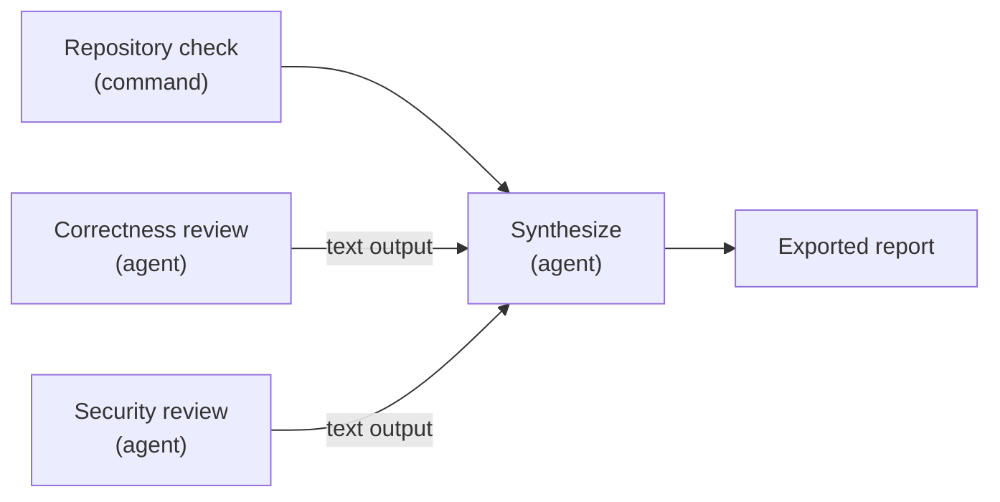

# Useful Machinery CLI

Useful Machinery CLI turns repeatable engineering work into explicit, durable workflows.
Define commands and coding agents in one repository-owned YAML file, connect typed
outputs to downstream steps, run independent work concurrently, and retain a result you
can inspect instead of reconstructing what happened from terminal scrollback.

The CLI is the open-source command-line and runner executable for Useful Machinery. It can
run workflows locally with Pi, Claude Code, and Codex, or serve them from an enrolled
outbound runner. The project is early, but the local workflow engine and its authoring,
execution, and inspection tools are available today.

## Why Useful Machinery

Coding-agent automation often begins as a loose sequence of shell commands, prompts,
and copy-and-paste handoffs. That approach becomes difficult to repeat, supervise, and
recover once work spans several tools or agents. Useful Machinery gives the work a runtime:

- **One graph for commands and agents.** Express control flow and typed data flow in a
  workflow dependency graph instead of coordinating scripts and model sessions by
  hand.
- **Parallel work with explicit handoffs.** Let independent steps run concurrently, pass
  text, schema-validated JSON, and files to downstream work, and export Git branch
  results when a workflow changes a repository.
- **Durable execution.** Follow progress in the terminal, inspect retained runs later,
  recover bounded step failures, and retry eligible runs explicitly.
- **Repository-owned automation.** Version workflows, prompts, attachments, and result
  schemas beside the code they operate on.
- **Validate before you spend.** Resolve the complete workflow bundle and check its
  graph, references, types, files, and policy offline before starting commands or
  consuming model tokens.

## What you can build

Use Useful Machinery to:

- run tests, linters, builds, and several independent code reviews in parallel, then
  combine their findings in one final artifact/PR;
- have one agent extract schema-validated facts and pass them directly to another agent
  for planning, review, or synthesis;
- mix deterministic command steps with agent work, while preserving typed outputs for
  downstream steps and callers;
- add bounded recovery to flaky work and finalizers for cleanup or outcome-specific
  reporting; and
- retain machine-readable results and portable artifacts for later inspection or use by
  other tools.

The bundles under [`examples/workflows/`](examples/workflows/) include ready-to-run
recipes for command data flow, parallel agents, structured results, recovery,
cancellation, advisory failures, attachments, and finalizers.

## A workflow at a glance

This workflow makes a repository check and two agent reviews eligible to run
concurrently. The final agent waits for the check and receives both review outputs:



In Useful Machinery workflows, output references create the data-flow edges automatically:

```yaml
# yaml-language-server: $schema=https://docs.usefulmachinery.com/schemas/workflow-v1.schema.json
schemaVersion: 1

description: Check a repository, review it in parallel, and combine the findings.

agentProfiles:
  coding:
    harness:
      kind: pi
      config:
        model: provider/model
        thinking: high

steps:
  check:
    kind: cmd
    command:
      argv: ["./scripts/check"]

  correctnessReview:
    kind: agent
    agent:
      profile: coding
      systemPrompt: prompts/reviewer-system.md
      message:
        text:
          - file: prompts/review-correctness.md
    outputs:
      notes:
        kind: text
        from: agent_response

  securityReview:
    kind: agent
    agent:
      profile: coding
      systemPrompt: prompts/reviewer-system.md
      message:
        text:
          - file: prompts/review-security.md
    outputs:
      notes:
        kind: text
        from: agent_response

  summarize:
    kind: agent
    dependsOn: [check]
    agent:
      profile: coding
      systemPrompt: prompts/reviewer-system.md
      message:
        text:
          - file: prompts/summarize-reviews.md
          - ref: outputs.correctnessReview.notes
          - ref: outputs.securityReview.notes
    outputs:
      report:
        kind: text
        from: agent_response

exports:
  report:
    ref: outputs.summarize.report
```

Replace the example model with one available through your Pi installation and add the
referenced prompt files. Then validate the bundle without executing it, run it in a new
durable run directory, and return to that run later:

```sh
um workflow validate \
  --source-root . \
  .um/workflows/review.yaml

um workflow run \
  --source-root . \
  --execution-root . \
  --run-dir ~/.um/runs/review-001 \
  .um/workflows/review.yaml

um workflow status ~/.um/runs/review-001
um workflow view ~/.um/runs/review-001
```

During execution, Useful Machinery schedules ready steps, supervises each command or fresh agent
session, captures declared outputs, and publishes one durable terminal result. The same
run handle works for noninteractive status, archived inspection, and an explicit retry
when the retained state is eligible.

## Current capabilities

The current release supports:

- offline Workflow V1 validation, an installed authoring reference, and structural JSON
  Schema output;
- local command, Pi, Claude Code, and Codex DAG execution with typed data flow,
  concurrency, recovery, finalizers, imports, exports, durable status, retry, and
  archived inspection;
- portable Artifact Set V1 validation without the original run or source checkout;
- OAuth device login, renewable human sessions, linked sign-in identity management,
  explicit service API-key authentication, service-principal creation and credential rotation,
  human-service delegation management, logout, account signup, display-name management, account and organization deletion
  scheduling, organization discovery, profile management and owner audit history,
  invitation issuance and lifecycle management, the
  current principal's invitation inbox, one-page member-directory reads, actor-bound GitHub App setup,
  installation and repository discovery, complete project and repository configuration,
  mixed named-input and inputless Cloud run creation, explicit single-use Run Input Set
  administration, retained-input inspection/download/deletion, terminal waiting, and
  Artifact Set download and inspection;
- runner and runner-pool administration plus prerequisite diagnostics; and
- enrollment and service operation for an outbound runner that connects only to its
  Cloud-issued endpoint and waits for explicit start authorization.

The Cloud management surface is not complete. The CLI can discover and manage accessible
organizations, manage invitations and membership, connect GitHub App installations,
discover authorized repositories, manage projects and runner pools, create mixed-input
or inputless runs for a ready project, administer Run Input Sets, inspect/download/delete
retained run inputs, wait for terminal status, and download verified Artifact Sets. It
does not yet guide the rest of Cloud onboarding.

## Service principals and API keys

Create a service principal while signed in as a human, and direct its show-once initial
API key to a new private file:

```sh
um service-principal create \
  --display-name "Build agent" \
  --api-key-file ./build-agent.key
```

The destination is created with mode `0600` and is never overwritten. Use
`--api-key-file -` only for a deliberate secret pipeline; it writes only the API key to
standard output and sends status to standard error. `--json` cannot be combined with
that stdout form, and JSON output never contains an API key. A signal before request
dispatch stops creation or issuance; after dispatch, the CLI completes the bounded
request and key delivery despite a later `SIGINT` or `SIGTERM` so a committed one-time
key is not discarded. If destination write or synchronization fails,
`api_key_delivery_failed` preserves the known non-secret metadata, destination, and safe
recovery classification. The receipt reports destination cleanup as `removed`,
`not_applicable` for standard output, or `uncertain`. File cleanup is attempted immediately; `uncertain` means the key may remain
at the destination and the operator must protect, inspect, and remove it before deciding
whether to revoke the known credential. The CLI does not revoke it automatically. If an
idempotent replay returns credential metadata without the show-once key, the CLI reports
`api_key_unavailable`, preserves the metadata in JSON, attempts to remove the reserved
output file, and does not issue or invent a replacement.

Service credentials are explicit per invocation. The CLI does not persist a service API
key or fall back between a service key and the human credential store:

```sh
um service-principal credential list \
  --service-api-key-file ./build-agent.key

um service-principal credential issue \
  --service-api-key-file ./build-agent.key \
  --api-key-file ./build-agent-next.key

um service-principal credential revoke \
  crd_01k0z6r1w8f4jy2m7q9v3x5abc \
  --service-api-key-file ./build-agent-next.key \
  --yes
```

Input key files must be regular, non-symbolic-link files owned by the current user with
mode exactly `0600`. A trailing newline is accepted. `--service-api-key-file -` reads one
key from standard input. Keys are redacted from debug values and are never emitted in
JSON, diagnostics, or ordinary logs. Credential listing returns non-secret metadata
only; issuance requires an existing platform API key, and revocation requires a
different active key because a credential cannot revoke itself.

Cloud-management leaves whose public API operation permits a service actor also accept
`--service-api-key-file PATH|-`. This includes service-capable account profile and
self-deletion operations; current-principal status and identity management;
organization, invitation, GitHub, project, publication, run, retained-input, Artifact
Set, runner-pool, and runner-administration operations. Identity linking by a service
also requires `--workload-token-file PATH|-` containing a fresh token from a configured
workload issuer. Both files use the same private-file checks and cannot both consume
standard input.

Human-only operations remain human-only: login, logout, signup, service-principal
creation, account-deletion cancellation, and organization-deletion request or
cancellation do not accept service API-key authentication. A service creating an
organization must additionally pass `--delegator-principal-id` with the exact human
principal from an active delegation. Delegation is attribution only: the service must
still hold its own required organization membership and role for every organization
operation, and the CLI never borrows authority from the human credential store.

Service API keys are also separate from runner credentials. They can authorize runner
administration when the service has the required organization role, but they cannot
enroll a runner, start `runner serve`, authenticate the runner connection, or replace a
runner activation or runner credential.

## Delegations

A signed-in human proposes a delegation to one exact active service principal:

```sh
um delegation propose prn_01k0z6r1w8f4jy2m7q9v3x5abc
```

Proposal is deliberately human-only. Acceptance is deliberately service-only and always
requires the nominated service's explicit API-key input; the CLI never substitutes a
stored human session:

```sh
um delegation accept dlg_01k0z6r1w8f4jy2m7q9v3x5abc \
  --service-api-key-file ./build-agent.key
```

Either exact participant may list, show, or end its relationships. Omit
`--service-api-key-file` to use the renewable human session, or supply it to act as the
service. Listing returns one page and exposes an opaque next cursor when another page is
available:

```sh
um delegation list --limit 50
um delegation list --cursor <CURSOR> \
  --service-api-key-file ./build-agent.key
um delegation show dlg_01k0z6r1w8f4jy2m7q9v3x5abc
um delegation end dlg_01k0z6r1w8f4jy2m7q9v3x5abc --yes
```

Ended relationships remain visible in delegation history with their terminal timestamp
and reason. Accepting or ending an already ended relationship returns the stable
`delegation_transition_unavailable` outcome; an inaccessible relationship returns
`not_found` without revealing whether it exists. Delegations do not expire under the
current public API contract. An expired or revoked actor credential instead returns
`unauthenticated`. Delegation records attribution only and never lends organization
membership or any other authority.

## Public API contract

Download the customer OpenAPI contract from its stable public URL:

<https://docs.usefulmachinery.com/openapi/public-api.yaml>

The hosted file describes the API deployed at `https://api.usefulmachinery.com`. A particular CLI
build remains self-contained: it uses the generated Rust client committed under
`crates/api/src/generated/` and does not fetch the hosted contract at build time or run time. Each
generated source header records the OpenAPI Generator version and SHA-256 digest of the
canonical contract used for that client, so its provenance identifies the contract used by
that CLI build even when the deployed API contract has since changed.

## Local workflow validation

Use `um workflow validate` to resolve a checked-out Workflow V1 bundle
without running it:

```sh
um workflow validate \
  --source-root ./my-repository \
  ./my-repository/.um/workflows/check.yaml
```

Ready-to-run command and agent bundles are available under
[`examples/workflows/`](examples/workflows/). They cover basic DAGs, command input and
output dataflow, recovery, advisory and required failures, cancellation, all three agent
harnesses, structured agent results, attachments, and workflow finalizers. Definition
validation is offline; running an agent example requires its selected harness and
provider credentials and may consume billed tokens.

`--source-root` is required and defines the complete directory boundary for the
selected workflow YAML and all static prompts, message files, attachments, and result
schemas. The workflow file is an ordinary host path resolved from the process's initial
working directory, then canonicalized and required to remain within that explicit root.
The CLI does not infer the boundary from an enclosing repository or the YAML file's
directory.

For concise, version-aligned authoring guidance from the installed executable, run:

```sh
um workflow reference
```

The command writes its version-aligned embedded Markdown unchanged to standard output.
It includes the supported authoring loop, language semantics, safety boundaries, a
checked example, and these stable public handoffs:

- [Workflow V1 authoring guide](https://docs.usefulmachinery.com/agent/workflow-authoring.md)
- [Workflow V1 language reference](https://docs.usefulmachinery.com/reference/workflow-v1.md)
- [Workflow V1 raw schema](https://docs.usefulmachinery.com/schemas/workflow-v1.schema.json)

It needs no source checkout, workflow file, configuration, credentials, or network
access.

Retrieve the self-contained Workflow V1 JSON Schema from an installed executable
without a source checkout:

```sh
um workflow schema > workflow-v1.schema.json
```

The command writes raw JSON Schema bytes without a wrapper or preamble and preserves the
canonical asset's single terminal newline. It needs no workflow file, configuration,
credentials, or network access. Configure a JSON Schema-aware YAML editor or validation
tool to use the emitted file or the stable public raw-schema URL above; every schema
reference resolves within the document. Do not add a `$schema` property to the workflow
document.

The emitted schema checks document structure only. `workflow validate` remains the
complete workflow definition validator: it additionally checks the step graph,
references, path containment, static files, types, and policy. Passing a schema check
alone therefore does not establish that the CLI will accept the complete workflow
definition and its referenced files.

A successful human result reports the normalized source-root-relative workflow path,
the SHA-256 digest of the resolved source closure, step count, and required named input
interface. It never prints static file contents. Add `--json` for one schema-version-1
result with `valid` or `invalid` as its closed `outcome`; invalid results contain one
bounded CLI-owned diagnostic rather than parser or schema-library error text.

This command performs definition resolution only. It does not admit or start a run,
execute command or agent steps, check harness or model availability, read human or
runner credentials, or contact Useful Machinery. A zero exit status means only that the
local definition resolved successfully.

## Remote artifact metadata and download

List one page of a run's sealed Artifact Set without downloading it:

```sh
um artifact list acme-research run_01k0z6r1w8f4jy2m7q9v3x5abc \
  --limit 50
```

The result includes whole-set identity, seal and retention times, total member and byte
counts, and each member's portable path, media type, size, and SHA-256 digest. Members
are in portable-path order. `--limit` accepts 1 through 200, and `--cursor` continues
from the opaque `next cursor` value; the limit may change between pages. Add `--json`
for a schema-version-1 result with `outcome: "listed"` and the page under `artifactSet`.

Listing calls only the metadata inventory operation. It does not request exact download
capabilities, read artifact bytes, or create output files. A missing run and an
unattached, deleted, or not-yet-sealed Artifact Set are deliberately indistinguishable
and produce `outcome: "unavailable"`; an elapsed retention window produces
`outcome: "expired"`. Both states return a nonzero status, as do authorization,
network, invalid-cursor, and invalid-response outcomes.

Download and verify the complete set only when its bytes are needed:

```sh
um artifact download acme-research \
  run_01k0z6r1w8f4jy2m7q9v3x5abc --output ./downloaded-attempt-result
```

Download continues through every inventory page, requests fresh exact capabilities in
bounded batches, verifies each member and the complete portable set, and atomically
creates the requested output directory only after complete validation. Add `--json` for
one schema-version-1 receipt with `outcome: "downloaded"`, the Run and Artifact Set IDs,
verified member and byte totals, the committed destination, and deployment. A failed
transfer or verification emits no receipt and never commits the destination.

## Portable artifact validation

Validate one copied or downloaded Artifact Set V1 directory without its original run,
workflow source, or execution checkout:

```sh
um artifact validate ./downloaded-attempt-result
```

The command validates the complete closed `result.json` contract and every declared
export. It checks the exact root and `exports/` inventory, aliases, portable carrier
paths, confined regular-file identity, sizes, SHA-256 digests, media types, UTF-8 text,
compact ordered JSON, and changed or zero-delta `git_branch` artifacts. Git validation
checks the closed semantic metadata, carrier-presence rule, bundle-v2 header and profile,
pack framing and checksum, and reconstructible object facts without a destination
repository. Unknown kinds are rejected. There is no single-export selector or repair
mode.

Validation opens the selected directory read-only, follows no symbolic link beneath its
opened root, and leaves the set unchanged. It does not read workflow-run state,
credentials, or configuration, and it does not contact Useful Machinery, a provider, a Git
remote, or any other network service.

Add `--json` for one Artifact Validate Result Schema 1 document. A valid result has
`outcome: "valid"`, `exitStatus: 0`, the canonical artifact-directory path, and bounded
summary counts. An invalid result has `outcome: "invalid"`, `exitStatus: 1`, and the
complete contractually bounded deterministic diagnostic sequence instead of a summary.
Human mode reports the same diagnostic codes and ordering. Command-line usage errors
return 2 and do not inspect the artifact directory.

## Local workflow execution

Use `um workflow run` to execute a mixed command, PiJsonV1,
ClaudeCodeStreamJsonV1, and CodexAppServerV1 agent Workflow V1 DAG in an existing
caller-owned directory and create one durable local run
directory:

```sh
um workflow run \
  --source-root ./my-repository \
  --execution-root ./my-checkout \
  --run-dir ./runs/check-001 \
  --max-parallel 2 \
  ./my-repository/.um/workflows/check.yaml
```

The run directory must not exist and must be disjoint from the execution root. The CLI
normalizes it from its nearest existing parent and creates any missing parent suffix.
First-workflow onboarding uses the owner-private `~/.um/runs/` durable state root
by default; retained runs are application state and do not belong under `~/.config`.
The CLI retains immutable workflow and named-input bytes, durable closed run and attempt
state, and attempt 1's atomic result beneath `attempts/000001/result`. Every agent
invocation receives a fresh profile directory under
`attempts/<attempt>/diagnostics/` with immutable attempt, step, invocation, profile, and
exact-version metadata. PiJsonV1 and ClaudeCodeStreamJsonV1 additionally retain fresh
native session storage there; those sessions are never resumed, and Claude's temporary
ambient history links are removed when the invocation quiesces. CodexAppServerV1 starts
one fresh ephemeral thread and uses one transient owner-private SQLite directory beneath
invocation staging. App Server events remain authoritative, the SQLite directory is
removed after settlement, and no Codex-native thread or file is retained. A Codex
protocol failure may retain the same bounded structural rejection document as the other
profiles. The run-directory path is the local run handle. Add `--json` for one terminal
schema-version-1 object on stdout while the live presentation remains on stderr, or
`--plain` to force the line presentation on stdout.

Retained harness diagnostics can contain sensitive prompts, model output, tool activity,
paths, and extension or provider state. Native sessions or diagnostic files may be
incomplete or malformed after failure, cancellation, or forced termination and are
diagnostic only: workflow status, results, retry, and recovery never read or reopen them
as authority. They remain owner-private after every terminal outcome, are not included in
published attempt results, have no stable viewer or download interface, and disappear
only when the owning durable run directory is removed.

An ordinary command or agent step may declare `recovery.retries` from 1 through 10 and
optionally one `cmd` or fresh `agent` handler. Without a handler, Useful Machinery immediately
rechecks the unchanged target. A handler can only return the closed `recheck` or
`gave_up` decision through its engine-owned private result transport; it is not a DAG
node and publishes no output. Every target recheck and handler is a fresh physical
invocation in the same execution root. Provisional target failures remain history, and
only the target invocation supplying terminal success commits outputs. Repeated external
effects are at-least-once: authors supply stable domain idempotency keys through existing
explicit inputs or admitted environment, never from Useful Machinery invocation or round IDs.

Every declared root input is required. Supply Text with `--input-text <NAME> <TEXT>` or
`--input-text-file <NAME> <PATH|->`, JSON with `--input-json <NAME> <JSON>` or
`--input-json-file <NAME> <PATH|->`, and one File with
`--input-file <NAME> <MEDIA_TYPE> <PATH>`; append ordered attachment members with
`--input-attachment <NAME> <MEDIA_TYPE> <PATH>`, or provide a present empty collection
with `--input-attachments-empty <NAME>`. JSON is strict and may be constrained by a
retained workflow schema. File media types are explicit and optional declaration constraints
match exactly. All bindings are acquired before execution, and one Text or JSON file input
may exclusively claim standard input. Workflow commands always receive closed standard input.

Without `--plain` or `--json`, run uses the interactive terminal interface when stdin and
stdout are terminals, `TERM` is present and neither empty nor `dumb`, and stdin is not
reserved by a Text or JSON input. Every other combination keeps the plain line stream.
Stderr terminal status does not select the interface. `NO_COLOR` disables semantic color
under `--color=auto` but does not disable interactive mode; `--color=always` overrides it.

The interface keeps a stable step selection, an inspector, and bounded per-step logs.
Use `Up`/`Down` or `j`/`k` to select a step, `Enter` and `Escape` to enter and leave its
full log, and `?` for all log navigation controls. Wide and narrow terminals use
side-by-side or stacked layouts. Resizing recomputes the layout without leaving
interactive mode; below 64 columns or 20 rows a resize notice replaces the panes while
execution, `Ctrl-C`, and eventual `q` handling continue.

`Ctrl-C` requests the existing orderly `user_request` cancellation and does not abandon
owned child work. `q` is ignored while execution, publication, cleanup, or run ownership
is active. Once the retained attempt is complete, the interface remains open for
post-run inspection until `q`; Useful Machinery then restores raw mode, the alternate screen, and
the cursor before invoking the shared standard plain-summary renderer. The summary and
process status are therefore the same contracts used by forced plain output. Inspect the
durable run later with `workflow status <RUN_DIR>`; retry is always explicit.

A Claude Code profile is configured independently from Pi:

```yaml
agentProfiles:
  claude:
    harness:
      kind: claude_code
      config:
        model: claude-opus-4-1
        effort: high
```

`model` is a nonempty native Claude model string. `effort` is one of `low`, `medium`,
`high`, `xhigh`, or `max`; both fields are required and additional configuration is
rejected. Useful Machinery does not query a model catalog, install Claude Code, or supply a
fallback model or harness.

A Codex profile is also independent:

```yaml
agentProfiles:
  codex:
    harness:
      kind: codex
      config:
        model: gpt-5.4
        effort: xhigh
```

Both Codex values are required nonempty native strings, and additional configuration is
rejected. Useful Machinery does not read provider credentials during definition resolution,
installation discovery, rejection presentation, or doctor checks.

Local execution snapshots the inherited environment after resolution and removes
`UM_` variables before launching commands or agents. Other caller-provided values are
retained unless the closed harness profile fixes them. ClaudeCodeStreamJsonV1 removes
`CLAUDE_CODE_PROJECT_DIR_NAME` to keep retained-session routing authoritative and applies
its documented native controls; values such as `GH_TOKEN`, `GITHUB_TOKEN`, and Git or SSH
credential-helper configuration remain available for local repository setup and cloning.
The local caller owns that authority; Runner Serve applies a separate managed
credential-isolation policy. The CLI inspects the resolved agent steps and validates
each required harness once: `pi` for PiJsonV1, `claude` for
ClaudeCodeStreamJsonV1, and `codex` for CodexAppServerV1. Each search selects the first
executable candidate in inherited `PATH` and pins its canonical absolute path, exact
observed version, profile, and capabilities for the run. Claude Code must be a canonical
stable release in `>=2.1.234 <2.2.0`, and every native initialization frame must report
the pinned observed version exactly. Later `PATH` changes cannot switch an admitted
executable. Command-only workflows probe no harness; each single-harness workflow
requires no unrelated installation. A mixed workflow requires exactly its selected
harnesses and never substitutes or falls back between them. Workflow definitions,
imports, and remote values cannot supply an executable or alter selection. The adapter
does not read Useful Machinery human or runner credentials and does not contact Useful Machinery; an
admitted agent harness may use the provider and other host authority selected by its
closed profile and inherited environment.

Workflow V1 outputs declare semantic `kind` separately from acquisition `from`. The six
rows are `text/path`, `text/agent_response`, `json/path`, `json/agent_result`,
`file/path`, and `git_branch/workspace`; consumers and exports observe only the semantic
kind. A Git branch output is export-only and cannot bind a downstream command input or
agent message. Before any step
starts, local admission requires the execution root to be exactly one SHA-1 Git worktree
root and pins its current commit as the baseline. Successful capture requires a clean
committed head descended from that baseline. A changed head publishes one Git bundle
carrier; an unchanged head publishes the semantic zero-delta result without a carrier.
Repository remotes, destination branches, providers, credentials, and publication policy
are not workflow fields.

## Local workflow status

Inspect the durable state and retry eligibility of an existing local run without changing
it:

```sh
um workflow status ./runs/check-001
```

The run-directory positional is an ordinary host path resolved from the process's
initial working directory. Retry uses the same durable handle explicitly:

```sh
um workflow retry ./runs/check-001 --execution-root ./my-checkout
```

To reexecute a selected ordinary step and its downstream ordinary dependents,
inherit the other eligible ordinary steps by reference, and rerun all finalizers:

```sh
um workflow continue ./runs/check-001 --from build --from verify
um workflow continue ./runs/check-001 --from verify \
  --workflow ./revised-workflow.yaml --execution-root ./another-checkout
```

`--workflow` selects a replacement within the original retained source-root boundary;
without it the immediately prior attempt's retained definition is used. The execution
root is selected independently and defaults to the prior attempt's root. Accepted
`--json` writes the terminal result as one stdout object and emits the same accepted
partition record to stderr before execution. The initial
run inputs and primary-workspace Git baseline remain immutable. A continuation is
allowed only from an eligible latest failed, cancelled, or interrupted attempt, after
all retained process groups are proven quiescent. Before actions run, plain output
reports the ordered reexecuted and inherited partitions. Executed steps, recovery
handlers, and finalizers can read the credential-free `UM_CONTINUATION_CONTEXT`
file; initial runs and explicit retries do not receive this variable. A continued
step starts fresh; an inherited step has neither a new invocation nor a copied log.
A required body-data consumer of an inherited skipped output is rejected, while
conditions, advisory consumers, finalizers, and exports retain their normal
unavailable-value behavior. `workflow status` reports only base continuation
eligibility, not request-specific admission; an unavailable or incomparable historical
workspace snapshot yields `workspaceModified: "unknown"`.

Status reads only the closed `run.json` and `state.json` contracts and an existing
regular `run.lock`. For activated step recovery, plain and JSON snapshots report the
active or terminal target/handler role, round, target execution, decision, invocation
accounting and usage, raw terminal disposition, output ownership, and retry eligibility.
It never scans `.private`, creates the lock, acquires execution
ownership, waits for an owner, signals child work, or reads standard input. Its
non-acquiring lock query combines with two matching state revisions to distinguish an
active owner, a settled run, an abandoned nonterminal attempt, and ownership that cannot
be proven safely. An exact live process-group identity remains `ownership_unproven`; an
unlocked outstanding start action without its required process-guard registration makes
the run directory invalid rather than retry-eligible. The retry projection is eligible
or uses the first applicable closed reason in this order: `run_locked`,
`ownership_unproven`, `latest_attempt_succeeded`, then `latest_attempt_rejected`.

Without a mode option, and with `--plain`, one complete human snapshot is written to
stdout and operational diagnostics use stderr. `--json` writes exactly one ANSI-free
object conforming to
[`schemas/workflow-status-result-v1.schema.json`](schemas/workflow-status-result-v1.schema.json)
to stdout; run-directory, schema, lock-query, and unstable-snapshot failures are encoded
in that object rather than duplicated on stderr. Status has no TUI or live presentation
stream.

`--color` accepts `auto`, `always`, or `never`. It affects only semantic tokens in plain
output; `auto` requires terminal stdout, a usable `TERM`, and an unset or empty
`NO_COLOR`. JSON never contains ANSI. A complete snapshot returns 0 regardless of run
or retry disposition, an operational or output failure returns 1, and a command-line
usage error returns 2. SIGINT or SIGTERM before completed output returns 130 or 143,
respectively.

## Local workflow archived view

View a successfully published terminal attempt from one stable read-only snapshot:

```sh
um workflow view ./runs/check-001 [--attempt 1] [--plain | --json]
```

Omitting `--attempt` selects the current attempt from the snapshot. Without an explicit
mode, terminal stdin plus terminal stdout plus a usable `TERM` opens the existing frozen
archived TUI; every other stream arrangement prints a plain completed-attempt summary.
`--plain` and `--json` force their modes regardless of terminal capability and conflict
with each other. The command never opens `/dev/tty` or falls back after selecting the
TUI.

The plain summary contains retained attempt and execution identity, lifecycle, duration,
node disposition, direct typed causes, activated Recovery Summary Schema 1,
per-invocation usage and output ownership, terminal counts, outcome, cancellation, and
finalization facts. It does not replay events or print retained stdout or stderr,
commands, exports, artifact contents, or agent observations, and it claims no ordering
between retained streams.

`--json` writes exactly one ANSI-free document conforming to
[`schemas/workflow-view-result-v1.schema.json`](schemas/workflow-view-result-v1.schema.json).
A successful view returns 0 and embeds the complete validated immutable selected result,
including when the workflow outcome is failed or cancelled. Expected acquisition and
attempt-selection failures return 1 as the schema's closed error variant on stdout
without duplicate stderr prose. Usage errors return 2. Local serialization, output, or
terminal failures return 1 and do not append a replacement document after a partial
prefix.

The loader validates the retained workflow, published result, cross-document identity,
artifact set, and retained budget before exposing either the safe archived projection or
the complete wire result. It opens only the state-recorded publication once, never
acquires execution ownership, and does not retarget if a retry advances the run.

Use `q` to restore an active TUI and return 0 without a workflow-run summary. SIGINT and
SIGTERM interrupt any mode with status 130 or 143; noninteractive rendering, writing,
and flushing remain abandonable even when stdout is full. Viewer signals never cancel a
workflow. `--color` affects only plain and TUI styling; JSON is always ANSI-free.

## Version inspection

Use `um --version` or `um version` for conventional one-line
output. Use `um version --json` for the schema-version-1 structured contract:

```json
{
  "schemaVersion": 1,
  "command": "um",
  "version": "0.10.0",
  "executablePath": "/resolved/path/to/um",
  "buildIdentity": "unknown"
}
```

Packaged builds replace the local `unknown` build identity with their source revision.
The schema does not define a release channel.

## Human authentication

Use `um auth login` to authenticate through a browser on the same machine or
another machine. The CLI prints an activation URL and user code, never opens a browser,
and never listens for an inbound callback. Add `--json` to receive newline-delimited
schema-version-1 events. Use `--force` to start a new device authorization transaction
without checking an existing credential with the API.

Use `um auth status` to ask the selected deployment whether the current
identity is authenticated, requires signup, is unauthenticated, or is unreachable. Add
`--json` for the schema-version-1 structured result. Authenticated and signup-required
results preserve any server actions as complete opaque JSON values. The CLI does not
validate action IDs or guide origins, fetch guides, infer commands, or execute actions.
Status always contacts the public API, including when no local credential exists.

Manage the OIDC identities linked to the signed-in account under `auth identity`:

```sh
# List one page; the current local-session identity is marked when that page contains it.
um auth identity list --limit 50

# Continue when the result includes a next cursor.
um auth identity list --limit 50 --cursor "$NEXT_CURSOR"

# Prove control of another identity in a fresh browser/device flow and link it.
um auth identity link

# Remove a non-current identity by the opaque ID returned by list.
um auth identity remove idn_01k0z6r1w8f4jy2m7q9v3x5abc --yes
```

`auth identity link` keeps the session that passed preflight as the acting identity
and uses a separately issued access token only as the proposed identity proof. It
requests fresh browser/device authorization without `offline_access` and never writes
the proof to the credential store. The final request stays bound to the preflight
session; if that credential is rejected after another local sign-in replaces it, the
command stops instead of retargeting the proof. Standard rejected-credential cleanup
can remove an invalid acting session, and the JSON terminal event then reports
`localSessionIdentity` as `removed` rather than `unchanged`. The deployment still
enforces the proof audience, approved issuer, identity type, and ten-minute issuance
window. An identity already linked to any account produces the same
identity-unavailable result; linking never merges accounts.

Human-authenticated identity removal uses the current local session and never starts a
weaker proof path. The deployment requires that session's access token to have been issued within ten
minutes and refuses to remove either its exact identity or the last usable identity. To
remove the identity currently used on this device, first find the item marked `current`
in `list`. Listing is oldest-first and returns one page, so follow each `nextCursor` with
`--cursor` until the marked identity appears. Record that ID, run
`um auth login --force`, and choose a different identity already linked to
the same account. That fresh login replaces the local session. Removing the former
identity then leaves the replacement local session signed in and unchanged. A removal
command never deletes or revokes the current local credential. With
`--service-api-key-file`, removal instead uses the selected service authority and never
reads or changes the local human session. Deployment workload-identity policy and
service-actor authorization still apply.

Identity list and remove use one schema-version-1 JSON document with `--json`. Linking
uses newline-delimited schema-version-1 activation and terminal-result events because it
waits for browser authorization. Listing returns exactly one page and preserves
`nextCursor`; `--limit` accepts 1 through 200.

One successful login establishes a renewable human session. The CLI stores the one-hour
access token, its expiration, and a rotating refresh token in
`~/.um/credentials.json`, then silently renews access for every human-authenticated
command while the refresh session remains valid. Auth0 expires refresh sessions after 30
days idle or 90 days total.

Use `um auth logout` to remove the human credential for the active deployment
and ask Auth0 to revoke its refresh token. The result distinguishes confirmed and
unconfirmed server revocation; local removal still completes when Auth0 is unreachable.
The human store remains separate from workflow-run state and all runner credentials.

Development deployments that use HTTP require `--allow-insecure-http` on each networked
leaf command. This includes authentication and linked identity management, account,
organization, GitHub connection, project, Cloud run, and runner administration commands;
the option is not global.

## Account management

OAuth login does not implicitly create a Useful Machinery account. When authentication
status is `signup_required` and the deployment advertises signup, use
`um account signup` after the customer explicitly approves account creation.
Add `--json` for a schema-version-1 structured result. The CLI authenticates the request
with the existing human credential and retries an ambiguous transport failure once with
the same opaque idempotency key.

Set or clear the authenticated account's optional display name with exactly one of these
options:

```sh
um account update --display-name "Ada Lovelace"
um account update --clear-display-name
```

The deployment removes surrounding Unicode whitespace and accepts 1 through 200 Unicode
scalar values without control characters. An equivalent normalized name and clearing an
already absent name are successful no-ops. Successful human output says that the display
name is `set` or `cleared`; `--json` reports the same stable `outcome` and the active
`principal`. The principal omits `displayName` after a clear.

Each invocation generates a fresh opaque idempotency key. After an ambiguous transport
failure, the CLI retries once with the same key and exact merge patch. If the result still
cannot be confirmed, check `um auth status` before issuing another update.
Structured failures report one of `invalid_display_name`, `unauthenticated`, `forbidden`,
`idempotency_conflict`, `request_too_large`, `unsupported_media_type`, or `unreachable`.

Schedule deletion of the authenticated human account only after reviewing the 30-day
window and confirming explicitly:

```sh
um account deletion request --yes
```

A successful request reports the principal ID, `deletion_pending` state, request time,
deadline, and update time. It conditionally removes the exact local human credential
that authorized the request; it never removes a credential that another process replaced
while the request was in progress. The result reports `localCredential` as `removed` or
`changed`; a local cleanup error reports `removal_unconfirmed`, returns nonzero after
showing the confirmed schedule, and directs the user to local sign-out. An unconfirmed
API request retains the local credential and must not be repeated
until the lifecycle state has been confirmed with the deployment operator.

Supplying `--service-api-key-file PATH|-` to the request deletes the authenticated
service principal immediately instead of creating a schedule. A successful JSON result
reports `outcome: "deleted"`; the command does not read, remove, or update a human
credential store.

Cancel before the deadline with a fresh browser proof from the same still-linked identity:

```sh
um account deletion cancel
```

Cancellation does not use or require the stored local session. It requests a fresh
browser/device access token without `offline_access`, sends that token only as the API
bearer, and never stores it or a refresh token. A successful cancellation reports the
returned active lifecycle transition while leaving the credential store unchanged; run
`um auth login` afterward to establish a renewable local session. This
separation is intentional: an old stored credential, a refreshed background session, or
a different linked identity does not replace the API's distinct, later, same-identity
proof requirement.

`account deletion request --json` emits one schema-version-1 result. Cancellation emits
newline-delimited schema-version-1 `activation_required` and terminal `result` events
because browser authorization is part of the command. A repeated request or cancellation
with a new request identity reports `transition_unavailable` when the lifecycle is
already in the requested state or the transition is otherwise unavailable. Scheduling
also reports `human_owner_required` when deleting the account would leave an organization
without an effective human owner. Browser proof rejection reports
`reauthentication_required`; no outcome weakens the linked-identity or issuance-time
checks.

## Organization management

Organization commands default to the selected local human OAuth credential. Supported
commands accept `--service-api-key-file` to use explicit service authority instead,
without reading the human credential store; runner credentials are never used. Service
organization creation also requires `--delegator-principal-id` naming an authorized human
principal, and the deployment enforces the delegation contract. Organization deletion
request and cancellation remain human-only; cancellation uses the fresh proof flow
below. Other operations do not start login or signup. Organization references must be an
exact `org_` ID or lowercase URL-safe slug. The CLI rejects invalid references locally
and passes accepted references to the deployment without normalization.

```sh
# Discover your organization memberships and their organization IDs and slugs.
um organization list --limit 50

# Create an organization. The deployment may assign the slug when it is omitted.
um organization create \
  --display-name "Acme Research" \
  --slug acme-research

# Read an accessible active organization by ID or exact slug.
um organization show acme-research

# Update the display name, slug, or both. At least one option is required.
um organization update acme-research \
  --display-name "Acme Labs" \
  --slug acme-labs

# Schedule deletion for 30 days as a current active human owner.
um organization deletion request acme-labs --yes

# Cancel before the deadline with a fresh browser proof.
um organization deletion cancel acme-labs

# Read one active member-directory page. Both pagination options are optional.
um organization member list acme-labs \
  --limit 50 \
  --cursor opaque-continuation

# Read one owner-only page containing active, suspended, and ended memberships.
um organization member history acme-labs --limit 50

# Read one owner-only page of privacy-safe audit records.
um organization audit list acme-labs \
  --limit 50 \
  --cursor opaque-continuation

# Change another member's organization role.
um organization member update acme-labs \
  mem_01k0z6r1w8f4jy2m7q9v3x5abc \
  --role owner

# Permanently end another member's membership.
um organization member remove acme-labs \
  mem_01k0z6r1w8f4jy2m7q9v3x5abc \
  --yes

# Permanently end your own membership.
um organization leave acme-labs --yes
```

Add `--json` to any of these leaves for its schema-version-1 result. Organization
listing returns one oldest-first page of the selected principal's membership history.
Every row includes the membership and organization IDs plus lifecycle state. The
organization name and slug appear only while both the organization and membership are
active; suspended and ended rows retain history without exposing mutable organization
profile data. Pass the returned `nextCursor` back with `--cursor` to continue.

Organization, active-member, and membership-history listing each return exactly one
page, preserve `nextCursor`, and do not follow it automatically. Their `--limit` options
accept 1 through 200. Active-member listing remains available to effective members;
membership history and member changes require an active owner. History preserves
lifecycle fields while leaving an inactive principal's omitted display name absent.

Organization deletion request and cancellation require a current active human owner.
Cancellation additionally requires the same linked identity that scheduled deletion to
present a different browser-issued bearer with a strictly later issuer time. As with
account cancellation, the CLI obtains that proof through a fresh browser/device flow
without `offline_access`, sends it only as the cancellation bearer, and does not persist
it. Organization lifecycle commands never replace or remove the account's local human
credential. A successful request reports the 30-day `deletion_pending` schedule; a
successful cancellation reports the returned `active` or `suspended` transition.

Request uses one schema-version-1 result with `--json`; cancellation uses
newline-delimited `activation_required` and terminal `result` events. Owner denial stays
`forbidden` on request and is deliberately included in `reauthentication_required` on
cancellation so the CLI does not disclose whether a private target, actor, or proof would
otherwise qualify. Missing and inaccessible organization targets remain
indistinguishable. `transition_unavailable` handles a schedule or cancellation that is
already in the requested state or otherwise unavailable.

Audit listing also returns exactly one oldest-first page and preserves `nextCursor`, but
its `--limit` accepts 1 through 100. Only an active organization owner can use it. Human
output identifies each available record's actor, action, target, occurrence time, change
count, and retention snapshot. A record whose details cannot be projected remains in
place with `details: unavailable`, its occurrence and retention metadata, and the
redacted warning reason; the CLI does not infer actor, action, target, or hidden subject
details. `--json` emits the same closed records, `detailsStatus`, retention snapshots,
optional warnings, and cursor in a schema-version-1 `listed` result.

Role update accepts only `owner` or `member`. It does not expose membership suspension
or reactivation. Member removal and self-leave are terminal and require `--yes`. The
deployment enforces self-targeting, active-owner authorization, valid transitions, and
the requirement to retain an effective human owner.

Create, organization update, role update, removal, and leave generate a fresh opaque
idempotency key per process invocation. After an ambiguous transport failure, the CLI
retries once with the same key and serialized request. If both attempts are ambiguous,
it reports `unreachable` because the mutation result cannot be confirmed. It does not
persist the key or retry a contracted HTTP response. Do not issue a new mutation merely
because an earlier result was unconfirmed.

These commands use the selected human or explicitly supplied service authority within
the API's actor restrictions. Authentication status may carry a server-advertised
`organization.create` action, but the CLI only transports that value; a trusted external
guide owns action selection, explanation, and approval.

## Organization invitations

Invitation commands use the selected human OAuth credential by default and accept
`--service-api-key-file PATH|-` when an API operation permits a service actor. The
deployment authorizes the exact acting principal. Active organization owners can issue
invitations to either an active principal ID or an email address, inspect retained
invitation history, and revoke an outstanding invitation:

```sh
# Issue to exactly one target kind.
um organization invitation issue acme-labs \
  --principal-id prn_01k0z6r1w8f4jy2m7q9v3x5abc
um organization invitation issue acme-labs \
  --email teammate@example.com

# Read one owner-only page, including terminal history.
um organization invitation list acme-labs --limit 50

# Revoke an outstanding invitation.
um organization invitation revoke acme-labs \
  inv_01k0z6r1w8f4jy2m7q9v3x5abc --yes
```

The current principal can list directly targeted outstanding invitations, preview an
invitation, and accept or decline it:

```sh
um invitation list --limit 50
um invitation preview inv_01k0z6r1w8f4jy2m7q9v3x5abc
um invitation accept inv_01k0z6r1w8f4jy2m7q9v3x5abc
um invitation decline inv_01k0z6r1w8f4jy2m7q9v3x5abc --yes
```

Email-targeted invitation links contain a bearer capability. Supply it only through a
private regular file owned by the current Unix user, or through explicit standard input:

```sh
um invitation preview inv_01k0z6r1w8f4jy2m7q9v3x5abc \
  --capability-file ~/.config/um/invitation.capability
um invitation accept inv_01k0z6r1w8f4jy2m7q9v3x5abc \
  --capability-file - < ~/.config/um/invitation.capability
```

Capability files must use mode `0600`, must not be symlinks, and must be owned by the
invoking user. The capability's embedded
invitation ID must match the command argument. The CLI sends the value only in the API
request body, zeroizes the capability input buffer after use, and never includes it in
normal human or JSON output. This does not guarantee erasure of copies made by the
HTTP or TLS stack. Avoid command-line arguments, environment variables, shell history,
logs, and issue reports for capability values.

Preview, accept, and decline intentionally collapse expired, revoked, consumed,
inaccessible, and wrong-capability cases into `invitation_unavailable`; they do not reveal
which condition applied. Owner history retains `outstanding`, `accepted`, `declined`,
`revoked`, and `expired` states. Each list reads one page, preserves `nextCursor`, and does
not follow it automatically; limits accept 1 through 200.

Issue, revoke, accept, and decline generate a fresh opaque idempotency key and retry one
ambiguous transport failure with the same serialized request and key. They never retry a
contracted HTTP response. `--json` emits schema-version-1 results. Authentication and
failures use exit 3 when sign-in is required, exit 4 when the deployment is unreachable
or rate limited, and exit 1 for other rejected or unavailable outcomes.

## GitHub connections

GitHub commands use the selected human OAuth credential by default and accept
`--service-api-key-file PATH|-` when the operation permits a service actor. The deployment
requires the exact acting principal to be a current active organization owner. The CLI
uses a service credential only when explicitly selected and never substitutes a runner
credential, GitHub personal access token, or local Git credential.

Setup is deliberately split around browser consent. The CLI neither opens a browser nor
listens for an inbound callback. Begin a ten-minute, single-use setup session:

```sh
um github setup begin acme-labs
```

Open the reported URL in a browser and approve the GitHub account and repositories.
After GitHub returns from setup, copy the decimal installation ID from the browser return
URL and complete the same session as the same Useful Machinery principal:

```sh
um github setup complete \
  acme-labs \
  ghs_01k0z6r1w8f4jy2m7q9v3x5abc \
  --provider-installation-id 12345678
```

Completion uses the explicitly selected principal credential, while the deployment
enforces the setup session's exact actor and organization binding and verifies the
installation with the platform GitHub App credential. An expired or rejected completion
does not let the CLI substitute another actor, account, repository list, or provider
credential. Begin a
new setup session when the old session has expired.

List the organization's stable installation bindings and their current `active`,
`disconnected`, or `revoked` state:

```sh
um github installation list acme-labs
```

Discover the repositories currently authorized through one active binding. This is a
live provider-backed read and may update existing repository availability projections;
it does not bind a project or create repository connections eagerly:

```sh
um github repository list \
  acme-labs \
  ghi_01k0z6r1w8f4jy2m7q9v3x5abc
```

Remove an installation binding from Useful Machinery with its stable binding ID:

```sh
um github installation remove \
  acme-labs \
  ghi_01k0z6r1w8f4jy2m7q9v3x5abc --yes
```

Disconnection marks the binding and its repository connections unavailable for new
source use; it does not uninstall the GitHub App or rewrite accepted run provenance. A
still-valid disconnected installation can be reactivated only through a new verified
browser setup session. A revoked provider installation is terminal.

Add `--json` to any GitHub leaf for one schema-version-1 result. Setup begin returns
`pending` and the session, setup complete returns `completed`, installation remove
returns `disconnected`, and both list commands return `listed`. Expected failures use a
closed outcome without copying provider responses or API problem prose. Setup completion
and disconnection retry one ambiguous transport failure with the same session or binding
identity because the API defines exact replay; setup initiation and reads make one
request attempt. A later completion retry must reuse the same setup session and provider
installation ID.

## Linear triggers and evaluations

Organization owners configure project triggers against a connected Linear workspace. Create
requires a complete JSON object with explicit `enabled`, `source`, `target`, `conditions`,
`inputs`, and `integrationContext`. For example:

```json
{
  "enabled": true,
  "source": {"type": "linear", "connectionId": "lcn_01k0z6r1w8f4jy2m7q9v3x5abc"},
  "target": {"workflowPath": ".um/cloud/one-shot.yaml", "executionPrincipalId": "prn_01k0z6r1w8f4jy2m7q9v3x5abc"},
  "conditions": [{"field": "event.action", "operator": "eq", "value": "update"}],
  "inputs": {"ticket": {"kind": "file", "source": {"type": "snapshot"}}},
  "integrationContext": {"issue": {"type": "field", "field": "current.identifier"}}
}
```

The optional `publication` object (`{"exportName":"name"}`) selects the run export on
creation or replaces that selection on update. The `ticket` File input receives the
complete Ticket Snapshot Schema 1 JSON document; `file` accepts only `snapshot`.
Text and JSON mappings also accept `literal` or `field` sources; JSON literals
preserve null and structured values. Field names are a closed
vocabulary, not paths or expressions. Conditions and mappings are replaced as whole
collections, including an explicit empty object for clearing mappings. Update files
contain only the fields to replace, never `enabled` or `expectedVersion`:

```sh
um project trigger create ORG PROJECT --config-file trigger.json
um project trigger list ORG PROJECT --limit 50 --cursor CURSOR
um project trigger show ORG PROJECT TRIGGER
um project trigger update ORG PROJECT TRIGGER --config-file changes.json --expected-version 3
um project trigger disable ORG PROJECT TRIGGER
um project trigger enable ORG PROJECT TRIGGER
um project trigger delete ORG PROJECT TRIGGER --yes
um project trigger evaluation list ORG PROJECT TRIGGER --state failed --run-id RUN --limit 50
um project trigger evaluation show ORG PROJECT TRIGGER EVALUATION
```

Use `--config-file -` for stdin unless the service API key also reads stdin. Unknown,
missing, null and late-schema configuration properties are rejected before sending a
request. There is no automatic fetch-and-patch: a version conflict requires inspecting
and deliberately updating the selected version. Lifecycle actions use separate routes.
Lists return only one page; pass the printed opaque next cursor with the same filters
for another page. `--json` emits one schema-version-1 result with complete trigger
configuration or evaluation facts, including the immutable selected version, attempt,
reason, condition results, observations, and resulting or blocking run. History never
claims the run of an overlapping evaluation. The evaluation API deliberately does not
embed issue prose or snapshot bytes. After `run_created`, use `um run input show ORG RUN`
and `um run input download ORG RUN --member inputs/ticket --output DIRECTORY` (using
the configured File input name) to inspect the complete, verified Schema 1 file while
its retained Run Input is available. A deletion stops pending work, not runs already
admitted; retained evaluation history remains inspectable. If a mutation's response is lost,
`commitment_unknown` retains its idempotency key even if replay is refused; JSON
`replayOutcome` reports the closed replay failure without implying the first request failed.
Inspect the trigger and your access before deciding whether to repeat the operation.

## Linear evaluation recovery

An organization owner can start a new cycle for a failed evaluation while its
original 30-day history remains available. The cycle uses the original event,
connection, configuration and grant, and reads current Linear state again. It
does not retry an already created run or revive a stopped evaluation.

```sh
um project trigger evaluation retry ORG PROJECT TRIGGER EVALUATION --timeout 5m --json
```

The command prints the request key in JSON results, including an unknown
acceptance or interrupted observation. To recover after a process restart,
repeat the same command as the same owner with `--idempotency-key KEY`; do not
start with a new key until you have shown the evaluation. A timed-out or
interrupted observation does not cancel a cycle. A result reports the final
run, nonmatch, overlap, stopped, or failed state and its safe reason code;
unknown acceptance never claims a run was created.

## Linear connections

An active organization owner can connect a Linear workspace without supplying a Linear
credential to the CLI. The deployment manages the OAuth exchange and stores the grant;
the CLI prints only a consent URL, session identity, and nonsecret connection status.
It does not open a browser or listen for the callback. Use the selected human session
(or explicitly pass `--service-api-key-file PATH|-` for the same authorized principal):

```sh
um connection linear authorization create acme-labs
um connection linear authorization create acme-labs --connection-id lcn_01k0z6r1w8f4jy2m7q9v3x5abc
```

Open the URL in a browser as the initiating owner. By default, the command polls the
owner-bound authorization session until completion, failure, expiry, or recovery-required
status (up to 15 minutes). Use `--timeout 2m` to stop waiting earlier, or `--no-wait`
to return immediately after the consent URL. Neither stopping the CLI nor losing
access cancels callback processing. Save the session ID and inspect it later as the
same owner; do not start another session merely because polling stopped:

```sh
um connection linear authorization show acme-labs las_01k0z6r1w8f4jy2m7q9v3x5abc
um connection linear authorization wait acme-labs las_01k0z6r1w8f4jy2m7q9v3x5abc --timeout 5m
um connection linear list acme-labs
um connection linear show acme-labs lcn_01k0z6r1w8f4jy2m7q9v3x5abc
um connection linear remove acme-labs lcn_01k0z6r1w8f4jy2m7q9v3x5abc --yes
um connection linear delete acme-labs lcn_01k0z6r1w8f4jy2m7q9v3x5abc --yes
```

Remove erases the credential but reserves the workspace binding; delete also
releases that binding. Reauthorization targets the exact connection ID. Use `--json`
for schema-version-1 newline-delimited events when starting or waiting and a single
JSON line for inspection/lifecycle commands. A lost start response is retried only
with the same internally generated request key during that invocation. If commitment
remains unknown, inspect existing connections as the initiating owner before
deliberately starting another request; the CLI cannot recover an unknown session
by replaying a key in a later invocation. A known session ID remains available on
timeout, interruption, or polling failure. `recovery_required` is not success; inspect the
connection and start a deliberate reauthorization if appropriate. No response includes
Linear tokens, authorization codes, or PKCE verifiers.

## Project management

Project commands use the selected human OAuth credential by default and accept
`--service-api-key-file PATH|-` when an API operation permits a service actor. Project
IDs, GitHub installation binding IDs, and provider repository IDs remain exact authority
inputs; repository full names are display metadata only. Runner pools can be selected by ID
or exact name. Start by
discovering those values:

```sh
# Discover the current account's organization memberships.
um organization list

# Discover active and retained GitHub installation bindings for one organization.
um github installation list acme-labs

# Discover the repositories currently authorized for one installation.
um github repository list \
  acme-labs \
  ghi_01k0z6r1w8f4jy2m7q9v3x5abc

# Discover existing runner pools and copy a pool ID or exact name when needed.
um runner pool list acme-labs
```

Create a project from one discovered repository. Omit `--default-branch` to select the
provider-observed default branch, and omit `--pool-id` to create a valid project
that reports `runner_pool_unassigned` until configured:

```sh
um project create acme-labs \
  --name um \
  --installation-id ghi_01k0z6r1w8f4jy2m7q9v3x5abc \
  --repository-id 123456789 \
  --default-branch release \
  --pool-id rpl_01k0z6r1w8f4jy2m7q9v3x5abc

# Page projects and show one complete configuration and readiness projection.
um project list acme-labs --limit 50
um project show \
  acme-labs \
  prj_01k0z6r1w8f4jy2m7q9v3x5abc

# Rename without changing execution configuration.
um project rename \
  acme-labs \
  prj_01k0z6r1w8f4jy2m7q9v3x5abc \
  --name um-release
```

Repository and runner-pool settings are independent. `set` assigns or atomically
replaces the current value. Repeated removals are API-defined no-ops:

```sh
# Read, replace, update, or remove the repository binding.
um project repository show \
  acme-labs prj_01k0z6r1w8f4jy2m7q9v3x5abc
um project repository set \
  acme-labs prj_01k0z6r1w8f4jy2m7q9v3x5abc \
  --installation-id ghi_01k0z6r1w8f4jy2m7q9v3x5abc \
  --repository-id 123456789
um project repository update \
  acme-labs prj_01k0z6r1w8f4jy2m7q9v3x5abc \
  --default-branch stable
um project repository remove \
  acme-labs prj_01k0z6r1w8f4jy2m7q9v3x5abc --yes

# Assign, replace, or remove the runner pool.
um project runner-pool set \
  acme-labs prj_01k0z6r1w8f4jy2m7q9v3x5abc \
  rpl_01k0z6r1w8f4jy2m7q9v3x5abc
um project runner-pool remove \
  acme-labs prj_01k0z6r1w8f4jy2m7q9v3x5abc --yes
```

Human output always includes the complete project's `ready` or `blocked` verdict and its
ordered blockers. JSON mode wraps the public project representation in a
schema-version-1 command result and preserves `nextCursor` on one-page list operations.
Every mutation generates one fresh opaque idempotency key. An ambiguous connection or
response-body failure is retried once with the same key and serialized request, and an
access-token refresh within the invocation also retains them. Owner authorization and
same-organization repository and runner-pool checks remain server-enforced.

### Signed project webhooks

After a qualified maintenance cutover, owners can create a subscription with
`um project webhook create ORG PROJECT --config-file config.json`; use `-` for
bounded standard input, unless the service credential also reads standard input.
For example, the file may contain
`{"url":"https://receiver.example.com/hook","eventTypes":["run.failed"],"contextKeys":[]}`.
The secret in the first successful create or rotate response must be saved
privately at once; later inspection and idempotent replay return metadata only.
JSON create/rotate results retain the operation `outcome` and report
`secretDisclosure: "shown_once"` only when a validated signing secret is included;
`"metadata_only"` explicitly means no secret was recovered. Human output gives
the same warning. Never treat a metadata-only response as a new signing key.
`um project webhook update ORG PROJECT WEBHOOK --expected-version 1 --config-file patch.json`
replaces only supplied selections and never reads the version implicitly. Empty
`contextKeys` clears that selection. URL changes require a new subscription.

Members may `list ORG PROJECT`, `show ORG PROJECT WEBHOOK`,
`delivery list ORG PROJECT WEBHOOK --limit 20 --cursor CURSOR --run-id RUN_ID --state failed`
and `delivery show ORG PROJECT WEBHOOK DELIVERY`. Owners may also `enable`,
`disable`, `delete`, `rotate-secret`, `revoke-previous-secret`, and `test` with
`ORG PROJECT WEBHOOK`, or `delivery replay ORG PROJECT WEBHOOK DELIVERY`.
Deletion requires `--yes` and stops future sends; it does not erase retained history.
One page is returned with an opaque `nextCursor`; `--json` selects schema-version-1
results. The server enforces tenant and owner authorization. An uncertain
mutation outcome is not permission to issue a new key blindly: inspect the
resource first. For uncertain mutation failures, JSON retains the generated
`idempotencyKey`, known `projectId`, optional `webhookId` and `deliveryId`, and
`nextAction: "inspect_resource"`; human output also prints these non-secret
identities. Keep the original key for diagnosis, but do not retry in a new
invocation without first inspecting retained state. A completed replay returns
`metadataOnly: true` and cannot recover a signing secret. See
[receiver and recovery guidance](../docs/operations/webhook-delivery.md) for
raw-body signature verification, deduplication, overlap and retention.

## Cloud runs

List materialized runs within one organization (newest first) with bounded,
opaque-cursor pages. Filters combine with AND; repeat exact context matches:

```sh
um run list acme-labs --project-id prj_01k0z6r1w8f4jy2m7q9v3x5abc \
  --state-group active --created-after 2025-01-01T00:00:00Z \
  --integration-context source=linear --integration-context linearIssue=LIV-123 \
  --limit 50 --json
um run list acme-labs --project-id prj_01k0z6r1w8f4jy2m7q9v3x5abc \
  --state-group active --created-after 2025-01-01T00:00:00Z \
  --integration-context source=linear --integration-context linearIssue=LIV-123 \
  --limit 50 --cursor 'CURSOR_FROM_NEXT_CURSOR' --json
```

Text output includes run IDs, state, timestamps, project, workflow, context,
placement when available, and the next cursor; `--json` returns `items` and
`nextCursor` as in the API. Context is private: avoid shell-history exposure when
using context filters, and do not put context in logs. For ticket dispatch, write
`{"source":"linear","linearIssue":"LIV-123"}` to a protected file and supply
`run create --integration-context-file PATH`.

Run commands use the selected human OAuth credential by default and accept
`--service-api-key-file PATH|-` when an API operation permits a service actor. They use
the configured Useful Machinery deployment and remain separate from `um workflow`,
which runs and inspects local workflow definitions and run directories.

```sh
# Admit an inputless run without waiting for execution.
um run create acme-labs \
  --project-id prj_01k0z6r1w8f4jy2m7q9v3x5abc \
  --workflow-path workflows/build.yaml \
  --source-branch main \
  --display-name "Release checks"

# Or bind mixed values, including ordered and explicitly empty collections.
um run create acme-labs \
  --project-id prj_01k0z6r1w8f4jy2m7q9v3x5abc \
  --workflow-path workflows/build.yaml \
  --input-text-file request ./request.txt \
  --input-json settings '{"mode":"review"}' \
  --integration-context-file ./integration-context.json \
  --input-attachment evidence text/plain ./notes.txt \
  --input-attachment evidence application/pdf ./report.pdf \
  --input-attachments-empty optionalEvidence

# Create an open immutable set, upload its object members, and then seal it.
um run input-set create acme-labs \
  --project-id prj_01k0z6r1w8f4jy2m7q9v3x5abc \
  --input-text-file request ./request.txt \
  --input-attachment evidence text/plain ./notes.txt \
  --input-attachment evidence application/pdf ./report.pdf \
  --json > input-set.json
input_set_id=$(jq -er '.inputSet.id' input-set.json)

um run input-set upload acme-labs "$input_set_id" \
  --member-file inputs/request ./request.txt \
  --member-file inputs/evidence/000000 ./notes.txt \
  --member-file inputs/evidence/000001 ./report.pdf
um run input-set seal acme-labs "$input_set_id"

um run create acme-labs \
  --project-id prj_01k0z6r1w8f4jy2m7q9v3x5abc \
  --workflow-path workflows/build.yaml \
  --input-set-id "$input_set_id"

# Read the latest public projection.
um run show \
  acme-labs \
  run_01k0z6r1w8f4jy2m7q9v3x5abc

# Observe settlement for up to 30 minutes without changing the run.
um run show acme-labs run_01k0z6r1w8f4jy2m7q9v3x5abc \
  --wait --timeout 30m

# Retry an eligible terminal run; observe the durable receipt until it resolves.
um run retry acme-labs run_01k0z6r1w8f4jy2m7q9v3x5abc \
  --expected-version 7 --timeout 30m

# Request graceful cancellation; force is a separate explicit, separately keyed choice.
um run cancel acme-labs run_01k0z6r1w8f4jy2m7q9v3x5abc \
  --wait --timeout 30m
```

Without an input flag, `run create` admits an inputless run. The mixed-input flags may be
repeated in one invocation: Text uses `--input-text NAME TEXT` or
`--input-text-file NAME PATH`, JSON uses `--input-json NAME JSON` or
`--input-json-file NAME PATH`, a singular File uses
`--input-file NAME MEDIA_TYPE PATH`, and ordered attachment members use repeated
`--input-attachment NAME MEDIA_TYPE PATH`. `--input-attachments-empty NAME` preserves a
present collection with no members. A name may be bound once, except that attachment
members append to one collection in argument order. `--integration-context-file PATH`
supplies a private immutable flat JSON object whose keys and values are strings. It is
returned by run readers but is not a workflow input. Omitting the flag and supplying an
empty object have the same run semantics. The object allows at most 32 entries, 64 UTF-8
bytes per nonempty key, 1 KiB per value, and 16 KiB of compact JSON; empty values are
valid, U+0000 is not, and duplicate members reject locally. The encoded-size limit uses
compact UTF-8 JSON with the shortest JSON-required escapes, so `<`, `>`, `&`, U+2028, and U+2029
retain their literal UTF-8 size. The source document, including escapes and formatting,
is limited to 128 KiB so file and standard-input reads remain bounded.

One Text or JSON file source or the integration-context file may use `-` to claim standard
input. Exactly one such operand may claim standard input in an invocation; competing claims
reject before stdin is read or Cloud is contacted. File and attachment paths always name
regular files.

Text and JSON values are limited to 1 MiB, each File or attachment member to 64 MiB, all
values together to 256 MiB, named inputs to 256, and attachment members to 256. Text must
be UTF-8. JSON must be strict UTF-8 JSON with duplicate keys and excessive nesting
rejected before Cloud access. Bytes and explicit valid media types are preserved exactly,
including zero-length values. The CLI computes the canonical manifest digest, allocates
one input set, requests upload capabilities in batches of at most 100, uploads every
logical member, seals the set, and only then creates the run. A storage `412 Precondition
Failed` is treated only as evidence that seal verification is required; connection and
timeout failures are not treated as upload evidence. Storage uploads have a five-minute
request timeout, separate from the 20-second metadata-request timeout.

Use `run input-set create` to acquire local sources, compute the immutable manifest, and
allocate an open set. It returns the set metadata and ID without requesting upload
capabilities, writing object storage, or sealing. `run input-set show` inspects a set and
manifest. `run input-set upload` maps each selected logical member ID to a caller-owned
regular file with repeated `--member-file MEMBER PATH` flags. It rereads the authoritative
manifest, requires each file's exact size and digest, and reports accepted members
separately from `412` members that still require authoritative sealing. This permits a
later invocation to upload all object members or resume only missing members, including
one member such as `inputs/evidence/000001` from a larger attachment collection. Empty
attachment collections require no upload. `run input-set seal` completes authoritative
verification.
`run input-set delete ... --yes` makes a set logically unavailable and schedules exact-key
content cleanup. Once a set is sealed, pass
its exact ID to `run create --input-set-id`; this conflicts with every acquisition flag
and never restages content.

Create output reports the accepted Run ID and whether the deployment replayed the
request. One invocation keeps each mutation's idempotency key through an ambiguous API
transport retry and an access-token refresh; keys are not persisted for a later invocation.
If preparation stops after input-set allocation, the CLI reports its ID and recovery
steps on stderr even with `--json`; inspect or resume that set explicitly before
allocating another. An interrupt after run dispatch reports unknown acceptance rather
than claiming no run was created.

Retained content is explicit run-scoped administration:

```sh
um run input show acme-labs "$run_id" --json
# Omit --member to download every member, or repeat it for an exact subset.
um run input download acme-labs "$run_id" \
  --member inputs/request \
  --output ./retained-inputs --json
um run input delete acme-labs "$run_id" --yes
```

A download first validates the retained inventory, requests capabilities in batches of at
most 100, and verifies every selected size and SHA-256 digest. Omit `--member` to select
all members, or repeat `--member MEMBER` to select exact logical IDs; selected members
retain canonical manifest order. Members are written beneath the new destination using
their deterministic logical IDs, such as `inputs/request` and
`inputs/evidence/000000`. Private staging is atomically renamed only after all selected
members verify, and an existing destination is never replaced. Interruption before the
commit phase or any integrity failure leaves no committed destination; the CLI attempts
to unlink its private staging, which is filesystem cleanup rather than physical media
erasure. An interruption racing the atomic commit reports unknown commitment and
directs the caller to inspect the destination. Capability URLs, input bytes, and bearer
credentials are never included in command output. Retention expiry is reported as
`gone`. Successful deletion makes content logically unavailable and schedules exact-key
cleanup; it does not attest physical erasure and does not remove the run's integration
context. Both deletion commands require literal
`--yes`, use fresh idempotency keys, and report an unknown commitment if interrupted
after dispatch.

`run create`, `run show`, and `run cancel` accept `--wait` and optional
`--timeout DURATION` (positive integral `ms`, `s`, `m`, `h`, or bare seconds).
`--timeout` requires `--wait`. Create and cancel budgets begin after acceptance; show
starts immediately. The remaining wait budget caps credential refresh, read retries,
and each observation request; it does not bound the accepted mutation. Reads continue
through admitted creation. `run create --publish-export NAME` selects exactly one
`git_branch` workflow export for automatic publication after successful execution;
omitting it remains artifact-only. Without `--wait`, create returns on durable run
acceptance. With `--wait`, create/show observe execution, artifact attachment, the
handoff, and the linked automatic Publication using one timeout budget. A successful
Run with pending handoff is not settled; waiting never creates an attempt or switches
to a later manual attempt. Cancel observes only its receipt and terminal Run. A cancellation receipt being accepted or resolved is not by itself
proof of a stopped Run. Force requires explicit `--force`; to escalate use a new
idempotency key. Reuse `--idempotency-key` with the same mode and Run to reconcile an
uncertain response. Signals and timeouts stop only local observation.

`run retry ORGANIZATION RUN` always observes its retry receipt; `--expected-version`
requires a positive integer and `--timeout` limits observation after acceptance.
A single generated key is reused for ambiguous transport replay. POST acceptance alone
never reports application: only an applied GET receipt succeeds. JSON retry results
contain `schemaVersion`, `operation: retry`, `deployment`, `organizationRef`, `runId`,
`outcome`, nullable `requestId`, `idempotencyKey`, `receipt`, and `code`.
Outcomes are `applied`, exact-code `rejected`, `trigger_slot_conflict`,
`retry_pending`, `timed_out`, `observation_stopped`, `acceptance_unknown`, and
`error`. Rejection, conflict, and timeout exit 1; usage exits 2; authentication
exits 3; unresolved transport exits 4; SIGINT/SIGTERM exit 130/143. A known
interruption retains the request ID; unknown submission retains the key. Neither
cancels or creates another retry. Inspect the run and request before trying again.

For `run create`, `run show`, and `run cancel`, `--json` emits one
schema-version-1 object with `operation`, `deployment`, `organizationRef`,
nullable `runId`, `outcome`, full nullable `run`,
`publication`, `cancellationRequest`, nullable create `replayed`, and nullable `error`.
The error includes `code`, `idempotencyKey`, `requestedMode`, and `requestId` (nullable).
Progress goes to stderr. Human create/show results show the Run's automatic publication
handoff and any observed Publication state, outcome, receipt disposition, failure, and
redacted confirmed pull-request URL separately from execution. On failure, inspect the existing publication or handoff
and provider effects before creating another publication attempt. Human cancellation
errors retain the requested mode, known receipt, Run state, interruption, and artifact
delivery evidence for same-key reconciliation.
Create-wait exits nonzero on failed execution/publication; show-wait and cancel-wait
exit zero on observed settlement, regardless of the Run's execution result. Timeout
exits 1; SIGINT/SIGTERM exit 130/143 without sending a new cancellation request.

### Agent named-input-to-artifact loop

An authenticated agent can bind a prompt file to a workflow's named Text input and
complete the run using only stable JSON command surfaces and the downloaded local result:

```sh
set -euo pipefail
organization=acme-labs
project=prj_01k0z6r1w8f4jy2m7q9v3x5abc
request_path=./request.txt
artifact_path=./downloaded-run

um run create "$organization" \
  --project-id "$project" \
  --workflow-path workflows/build.yaml \
  --input-text-file request "$request_path" \
  --json > create.json
run_id=$(jq -er 'select(.outcome == "accepted") | .runId' create.json)

um run show "$organization" "$run_id" \
  --wait --timeout 30m --json > observed.json
jq -e '.outcome == "settled" and .run.state == "succeeded"' observed.json >/dev/null

um artifact download "$organization" "$run_id" \
  --output "$artifact_path" --json > download.json
jq -e '.outcome == "downloaded"' download.json >/dev/null
jq . "$artifact_path/result.json"
```

The input bytes remain at the caller-selected source path; they do not enter command
arguments or JSON receipts. `result.json` is inspected only after the complete Artifact
Set has been downloaded, verified, and committed at the requested destination.

## GitHub artifact publications

Publication commands use the selected human OAuth credential by default and accept
`--service-api-key-file PATH|-` when the operation permits a service actor. They turn one
available `git_branch` export from a succeeded Cloud run into a ready-for-review pull
request. Run success and export declaration alone do not publish anything automatically. A
caller may select `run create --publish-export NAME` to request one automatic attempt;
otherwise Publication commands create explicit post-run attempts.

The complete Publication command surface is:

```sh
# Create one attempt for an exact export and retain its identity.
um publication create acme-labs "$run_id" \
  --export changes --json > publication-create.json
publication_id=$(jq -er '.publication.id' publication-create.json)

# Create another attempt and wait locally for its terminal outcome.
um publication create acme-labs "$run_id" \
  --export changes --wait --timeout 30m

# Read the current attempt, optionally waiting for a terminal snapshot.
um publication show \
  acme-labs "$run_id" "$publication_id" --wait --timeout 30m

# List one oldest-first page of attempts beneath the run.
um publication list \
  acme-labs "$run_id" --limit 50
```

For a run submitted without publication intent, an explicit publication workflow
first creates and waits for the run, then creates and waits for the selected Publication:

```sh
set -euo pipefail
organization=acme-labs
project=prj_01k0z6r1w8f4jy2m7q9v3x5abc

um run create "$organization" \
  --project-id "$project" \
  --workflow-path workflows/publish.yaml \
  --json > run-create.json
run_id=$(jq -er '.runId' run-create.json)
um run show "$organization" "$run_id" \
  --wait --timeout 30m --json > run-observed.json
jq -e '.outcome == "settled" and .run.state == "succeeded"' run-observed.json >/dev/null

um publication create "$organization" "$run_id" \
  --export changes --wait --timeout 30m --json > publication.json
jq -e '.outcome == "succeeded"' publication.json >/dev/null
publication_id=$(jq -er '.publication.id' publication.json)
```

Alternatively, submit with `run create --publish-export changes --wait --json` and
inspect `.run.state`, `.run.publication`, and `.publication` in its one final JSON
object. Create-wait exits nonzero if execution, the handoff, or the automatic attempt
fails; show-wait exits zero on a terminal failure but retains the failure fields.
`no_changes` and `pull_request_already_merged` are successful Publication outcomes,
not newly created pull requests. Neither timeout nor a signal cancels remote work.

Without `--wait`, `publication create` returns after Cloud accepts the attempt. With
`--wait`, it polls the accepted Publication and exits zero only for a succeeded outcome.
The caller may supply an opaque `--idempotency-key`; otherwise the CLI generates one and
preserves it across the invocation's bounded acceptance retries and terminal output. The
command never accepts a repository, base, destination branch, pull-request metadata, or
branch-only mode. Cloud derives those values from the run and either reports
`no_changes`, creates or exactly reuses an open pull request, reports an exact
already-merged pull request, or stores a structured failure.

`publication show` is a read: without `--wait`, it emits the current snapshot; with
`--wait`, it polls until any terminal snapshot. Both forms exit zero when they retrieve a
stored failed Publication, so automation using `show --wait --json` must inspect
`outcome`. `publication list` returns only the requested page and preserves `nextCursor`
in JSON instead of following it automatically. `--timeout` requires `--wait`; omitting it
waits until terminal state or a process signal. Timeout, SIGINT, and SIGTERM stop only
local observation: they do not cancel, retry, delete, merge, or otherwise mutate the
Publication or its provider effects. Waiting JSON output is one complete document for
terminal, timeout, or fatal read outcomes and is empty when a process signal wins.

Publication consumes the run's existing private Artifact Set and grants no public
artifact access or download URL. Plain output contains only the public Publication
projection and credential-free, query-free provider links; it does not stream provider
logs or expose credentials.

## Runner doctor

Use `um runner doctor` to inspect the local prerequisites currently known to
the runner. The default set contains only `environment.command.git`. It executes the
`git` resolved from the runner process's `PATH`, requires a parseable version at least
`2.29.0`, and reports a pass or failure for that check. Select
`execution.harness.pi-json-v1` explicitly to check the `pi` inherited through the same
operator-controlled `PATH`, select `execution.harness.claude-code-stream-json-v1` to 
check `claude`, or `execution.harness.codex-app-server-v1` to check `codex` 
independently. A successful result does not mean the runner is ready to serve
assignments: runner configuration, machine identity, connectivity, and other 
execution requirements are not all checked yet.

```sh
# Run the default checks.
um runner doctor

# Run a named check. Repeat --check to select more than one registered check.
um runner doctor --check environment.command.git

# Validate the Pi installation selected from inherited PATH only.
um runner doctor \
  --check execution.harness.pi-json-v1

# Validate Claude Code independently, or repeat --check to inspect multiple harnesses.
um runner doctor \
  --check execution.harness.claude-code-stream-json-v1

# Validate Codex independently.
um runner doctor \
  --check execution.harness.codex-app-server-v1

# List IDs without running any checks.
um runner doctor --list-checks

# Emit the schema-version-1 JSON report.
um runner doctor --json
```

A selected harness check identifies its execution profile and compatibility policy in
both report formats, including when the harness is missing or incompatible. Human
reports label an available observed version separately from a supported range or exact
required version. When a range has a repository qualification release, the report shows
that qualification version separately rather than presenting it as the only admitted
release.

Checks are registered statically by components compiled into this executable. The
command does not load plugins, read human credentials, contact Useful Machinery, or change
runner configuration. It executes `git --version` with a five-second deadline, bounds
captured standard output, drains standard error without reporting it, and exposes only
a normalized numeric version in its report.

The Pi check searches inherited `PATH` in order, canonicalizes the first candidate named
`pi` that the current process can execute, and invokes that absolute path with one version
probe and one capability-help probe. The probes clear the child environment except for
the captured inherited `PATH`, fresh temporary Pi state and working-directory paths, and
the required isolation controls. Retaining `PATH` lets an environment-based launcher
resolve its interpreter without allowing another `pi` selection. It admits
canonical stable versions in the range `>=0.84.2 <0.88.0`; the repository qualifies
exact Pi 0.87.1. The capability probe accepts both the 0.84.2
`pi [options] [@files...] [messages...]` usage line and the 0.84.3+
`pi [options] [--] [@files...] [messages...]` line, while still requiring the JSON
event, custom-session-directory, extension, system-prompt append, and
invocation-scoped `--approve` capabilities required by `PiJsonV1`. It retains the exact
observed release, never falls through to another candidate after selection, and does not
inspect model metadata or
credentials, execute the caller's project, or read or write saved Pi project-trust
decisions. Missing, unexecutable, malformed, unsupported-version, and missing-capability
outcomes have distinct report codes.

The Claude Code check follows the same first-candidate and immutable-path rules for
`claude`, admitting canonical stable releases in `>=2.1.234 <2.2.0`. Useful Machinery does not
install or upgrade that executable. Its isolated `--version` and `--help` probes require the closed stream
input/output, partial-message, subagent-forwarding, explicit-session-identity,
permission-mode, setting-source, model, effort, append-system-prompt-file, and JSON-schema
capabilities used by `ClaudeCodeStreamJsonV1`. The report contains only status, profile,
observed version, supported range, exact repository qualification version, closed
capabilities, and the selected absolute path. Qualification remains pinned to `2.1.284`
and does not claim that every admitted release or unexecuted host received exact-binary
conformance. The report never exposes environment values, credentials, or loaded Claude
settings. The JSON report has no `ready` field.

The Codex check selects `codex` independently, accepts stable `>=0.147.0 <0.161.0`, and
requires the generated App Server schema capability used by CodexAppServerV1. Its
isolated version and schema probes do not read ambient `CODEX_HOME`, provider
credentials, or native configuration. The report contains the exact observed version,
supported range, exact repository qualification version `0.160.0`, closed capabilities,
and canonical executable without starting a thread. At execution, async-delivery
messages, structured asynchronous questions, form elicitation, and bounded additive
events remain unattended and cannot settle, approve, assign a project, persist, or
commit a workflow value.

## Runner serve

`runner serve` uses the protected `rrc_` credential created by `runner enroll`; it
never reads human OAuth credentials. Enrollment and service startup consume the same
closed operator configuration:

```json
{
  "schemaVersion": 1,
  "deploymentMode": "production",
  "runnerStatePath": "/var/lib/um/runner-state.json",
  "controlSocketPath": "/run/um/runner.sock",
  "workRoot": "/var/lib/um/work"
}
```

After enrollment has committed protected state, start the service with one value:

```sh
um runner serve --config /etc/scherzo/runner.json
```

Production operators should follow the private monorepo's
`docs/operations/runner-v1-deployment.md` runbook for confidential activation transfer,
service-manager shutdown allowance, control-plane cutover, drain, and recovery. That
operator runbook is intentionally outside this public CLI source mirror.

The connection URL, runner ID, and current credential come only from enrolled state.
There are no endpoint environment overrides or command-line aliases for the removed
Gateway, credential, transport-mode, workflow-mapping, source, workflow-path, and work
root options. `production` requires the Cloud-issued `wss://` connection URL.
`development` additionally permits `ws://` only for exact `localhost`, IPv4 loopback,
or `[::1]` hosts; it never permits a caller-selected endpoint. Deployment mode changes
transport security only. Every assignment supplies a pinned Cloud repository source,
and every runner materializes and verifies that source before admission.

Rotate a running host only with a replacement activation issued for its existing runner:

```sh
um runner enroll \
  --replace-credential \
  --activation-file /protected/path/replacement-activation.json \
  --config /etc/scherzo/runner.json
```

The command reports Cloud enrollment and live promotion separately. It stages the new
credential as pending without replacing the current credential, then asks Runner Serve
over the configured local socket to welcome and promote it in the existing boot. An
unreachable service or a pending authentication, protocol, network, or state-write
error leaves both credentials in protected state and returns nonzero; it never restarts
the service. Rerun the same command with the same protected activation file to retry a
staged credential without enrolling a third credential. On process startup, Runner
Serve prefers a usable current connection and then retries pending promotion. Keep the
old Cloud credential active until local status shows the replacement current and
`runner credential list` shows its `lastAuthenticatedAt`; then retire it with the fixed
grace or revoke it immediately if compromise is suspected. Never print an activation
artifact or runner state while transferring or verifying it.

Runner startup selects `pi`, `claude`, and `codex` independently from its inherited
operator-controlled `PATH`. Useful Machinery installs none of them. Each successful installation
is validated once and retained as an immutable executable, exact-version, profile, and
capability snapshot for the process lifetime: Pi requires `>=0.84.2 <0.88.0`, Claude Code
requires `>=2.1.234 <2.2.0`, and Codex requires capability-compatible stable
`>=0.147.0 <0.161.0` with exact repository qualification anchor `0.160.0`. Admission and invocation never repeat a lookup or probe. A missing
or incompatible installation leaves only that harness unavailable, so Runner Serve
continues to accept command-only and other available-harness assignments. An assignment
requiring the unavailable harness is rejected before launch, and selection never falls
through to another executable or harness. Assignments and workflow data cannot influence
selection.

Runner agent steps use the same production dispatcher, cancellation precedence, process
containment, descendant-quiescence boundary, result authority, and atomic publication
path as local execution; no runner protocol or credential boundary changes by harness.
Claude execution still requires native initialization to report the startup version and
uses fixed unattended `bypassPermissions`. Codex execution uses the closed ephemeral
App Server profile and fixed no-approval policy. Neither is a sandbox. The runner owner
remains responsible for trusted native configuration and filesystem, process, network,
resource, credential, and secret isolation. Follow the harness rollout runbook, including
the required native qualification boundary, service restart, selected-harness no-fallback
recovery, and the separately deferred first credentialed production-runner canary.

Runner protocol v1 implements exactly
`workflow_v1_cloud_inputs_artifacts@1`, including ordinary-step recovery, every closed
Workflow V1 output/export, and terminal recovery evidence. Assignment admission consumes
the immutable resolver-carried transition, invocation, retention, and encoded-outbox
capacity bound to the workflow source closure; Runner Serve does not re-derive formulas.
Recovery transitions carry compact settling-invocation evidence, and the portable result
owns the complete closed summary/history. All ordinary frames remain at most 64 KiB, and
at most one terminal frame per assignment may use the 32 MiB terminal class.

The runner reconnects after retryable network, timeout, rate-limit, Gateway restart, and
server failures with jittered backoff while retaining boot-scoped assignment state.
Credential rejection is terminal authentication; unsupported subprotocol or malformed
Cloud protocol is terminal protocol. Terminal outcomes exit nonzero without exposing
bearer material. The work root must be an existing directory. An offer reserves one
assignment-private root but starts no source or input work. After the matching prepare
effect, Runner Serve checks out the pinned source, verifies the authoritative canonical
Run Input manifest, downloads every member through fresh exact capabilities into random
0600 temporary files without redirects, and admits exact named Text, semantic JSON,
singular File bytes and media types, and ordered attachment collections before semantic
acceptance. The fixed preparation deadline is not extended
by progress. Verified staging remains under the assignment root through execution and is
removed or quarantined by the existing release path. Cloud commands, agents, and
finalizers receive the exact recorded source branch and pinned commit as
`UM_SOURCE_BRANCH` and `UM_SOURCE_COMMIT_OID`; local execution receives neither.
After the later start effect, a token-free repository helper can obtain lease-bound read
access only for the credential-free primary `origin`. Runner Serve disables the helper,
revokes every known issuance after process quiescence, destroys local helper and token
state, verifies all retained carriers in private staging, and releases the checkout
before artifact upload or terminal acknowledgement. Author code can deliberately query
that helper and copy its bearer into author-controlled output; the platform does not
claim to prevent that behavior. Transport receipt and semantic
acceptance remain separate, and execution remains bounded by the latest received lease
across same-boot reconnects.

While the service runs, standard error contains newline-delimited JSON. Each outbound
attempt completes one `runner.gateway_connection` event with safe runner and boot IDs,
server host and port, protocol progress and counts, retry classification, selected
backoff when applicable, and a closed outcome and error type. Each offered effect
completes one `runner.effect_acknowledgement` event after transport confirmation or an
earlier safe ending. Its `success` outcome means only that the gateway confirmed the
runner's transport acknowledgement; the runner does not emit `runner.run` yet. Completed
JSON records enter a bounded non-blocking queue, so a stalled standard-error consumer
cannot delay runner protocol work; saturation or output failure drops and counts a
record.

`runner serve` can also send those same reviewed spans to a user-owned OTLP/HTTP
protobuf receiver. There is no default destination: export is enabled only when
`OTEL_EXPORTER_OTLP_TRACES_ENDPOINT` or `OTEL_EXPORTER_OTLP_ENDPOINT` is non-empty. The
trace-specific endpoint is the complete request URL and takes precedence; `/v1/traces`
is appended to the generic endpoint. Remote endpoints must use HTTPS. HTTP is accepted
only for the exact `localhost` host or a loopback IP address. User information, queries,
fragments, remote cleartext, and non-HTTP protocols disable export without stopping the
runner.

The following standard OpenTelemetry environment variables are supported, with the
trace-specific value taking precedence over its generic equivalent:

- `OTEL_EXPORTER_OTLP_TRACES_ENDPOINT` / `OTEL_EXPORTER_OTLP_ENDPOINT`;
- `OTEL_EXPORTER_OTLP_TRACES_HEADERS` / `OTEL_EXPORTER_OTLP_HEADERS`, using the standard
  comma-separated `name=percent-encoded-value` form;
- `OTEL_EXPORTER_OTLP_TRACES_TIMEOUT` / `OTEL_EXPORTER_OTLP_TIMEOUT`, as an integer from
  1 through 30000 milliseconds; and
- `OTEL_EXPORTER_OTLP_TRACES_PROTOCOL` / `OTEL_EXPORTER_OTLP_PROTOCOL`, when set to
  `http/protobuf`.

For example, the receiver and its credential both remain under the operator's control:

```sh
OTEL_EXPORTER_OTLP_TRACES_ENDPOINT=https://telemetry.example.test/v1/traces \
OTEL_EXPORTER_OTLP_TRACES_HEADERS='authorization=Bearer%20operator-owned-token' \
  um runner serve --config /etc/scherzo/runner.json
```

`OTEL_SDK_DISABLED` is the sole remote-export privacy switch. Case-insensitive `true`
vetoes export even when every exporter variable is set; unset, empty, or
case-insensitive `false` permits an explicitly configured endpoint. Any other non-empty
value disables export and emits only a closed local diagnostic. The switch never
disables local JSON or W3C Trace Context propagation.

OTLP work uses a bounded, non-blocking queue, bounded requests and shutdown, and no
application retry. Receiver failures, rejection, stalls, saturation, malformed
configuration, and shutdown timeout cannot change WebSocket traffic, acknowledgements,
backoff, results, or exit status. Diagnostics are emitted at most once per closed
classification and contain no endpoint, header, response body, or raw exporter error.
Local JSON continues alongside export.

The WebSocket upgrade carries only the connection span's W3C `traceparent` (and a
non-empty `tracestate`, if one exists), never baggage. The gateway can extract it as the
session's remote parent. Effect acknowledgement spans remain independent roots and use
the existing runner, boot, run, assignment, and effect IDs for correlation. Exported
resource metadata contains only `service.name=um-runner`, the package version, and
the generated boot ID as `service.instance.id`; arbitrary resource environment
attributes are not imported.

Service events never contain the machine credential, endpoint path or query, raw
protocol frames, WebSocket close reasons, or arbitrary network errors. OTLP credentials
are supplied only by the user through the standard header variables; the runner ships
no Useful Machinery-owned endpoint, ingestion credential, Honeycomb behavior, or collector
requirement. Human and JSON output contracts for help, version, authentication, account,
and `runner doctor` remain unchanged and do not initialize runner telemetry.

Cloud rejections and local enqueue failures during artifact registration and confirmation
emit a local JSON diagnostic named `runner.artifact_delivery_failed`. Its assignment,
attempt, and delivery IDs identify
the affected transfer. `um.artifact.failure_origin` distinguishes `runner` from
`cloud`; `um.artifact.operation` identifies `registration` or `confirmation`,
independently of the public delivery phase. Local enqueue failures retain the closed
codes `outbox_capacity`, `outbox_encoding`, and `outbox_sequence`. Cloud failures retain
their closed response code and `um.protocol.request_message_id` for correlation
with protocol frame logs. These diagnostics exclude upload URLs, artifact contents,
and raw errors.

If a Cloud workflow result cannot be serialized for Artifact Set delivery, the
runner retains `result-publication-failure.json` under that assignment's private
run directory. It records the original workflow issue, structural step metadata,
the publication failure code, and the failed command's bounded output when
available. The file is mode `0600` and stays on the runner with the failed
workspace; it is not a portable Artifact Set or a publication receipt. Command
output may contain sensitive data, so inspect it only through operator access.

## Release policy

`release.toml` schema 2 contains only static policy: the initial release is `0.1.0`, the
source-development version is `0.0.0-dev`, and breaking impact before `1.0` is minor.
Native Cargo builds always report the development fallback. Nix development packages
inject a revision-bearing development version, while allocated release builds inject
their exact approved version.

Run `./scripts/check-release` to validate the policy and Cargo fallback. Impact and
version arithmetic in `./scripts/release-impact` is pure over this policy, explicit
impact, and an optional latest stable version. Source checks never fetch or inspect
public tags. The files in `changes/` are a frozen legacy archive; new intent is reviewed
in the canonical private journal before this standalone tree is mirrored.

Managed publication allocates one exact version after review and mirrors an immutable
allocation record with the source. Metadata-branch creation is ignored by workflow push
triggers, and provider rules forbid updating or deleting those content-addressed refs.
GitHub Actions verifies the allocation and any separately approved recovery chain from the
accompanying public `main` push; it never chooses a version from mutable tags. The
three native builds always check out the original allocated mirror for x86-64 and ARM64
Linux and for Apple Silicon macOS. The final write-scoped job creates or
reconciles only matching tag and draft state, then publishes the exact archives,
`SHA256SUMS`, and GitHub build-provenance attestations on the
[Releases](https://github.com/useful-machinery/um/releases) page. Exact
published state and repeated valid recovery are no-ops.

Release binaries are not currently signed or notarized. Verify a downloaded archive
with the attached checksums and GitHub attestation before running it:

```sh
archive='um-<version>-<target>.tar.gz'

# Linux
sha256sum --ignore-missing --check SHA256SUMS

# macOS
shasum -a 256 --ignore-missing --check SHA256SUMS

gh attestation verify "$archive" \
  --repo useful-machinery/um
```

## Source boundary

Everything in this repository builds and tests using only its checked-in source and
declared external dependencies. The canonical check verifies that the public source is
self-contained.

## Contributing

> [!IMPORTANT]
> This repository is a read-only mirror. Public Discussions are welcome, but pull
> requests cannot be merged into the mirror directly.

See [`CONTRIBUTING.md`](CONTRIBUTING.md) for feedback channels, development checks, and
security-reporting guidance.

## Development

The repository contains a standalone devenv environment with the pinned Rust toolchain.
Run the canonical check from the repository root:

```sh
./scripts/check
```

The command uses `scripts/strict-devenv` to remove the caller's environment before
Devenv constructs the declared test environment. This is the same entrypoint used by CI.
It preserves `CARGO_BUILD_JOBS`, `CARGO_HOME`, `CARGO_TARGET_DIR`, and `RUSTC_WRAPPER`
so build limits, a caller-owned registry and build cache, and runner-owned compiler
coordination survive the clean boundary instead of recompiling the dependency graph
from cold on every run. Jobs are per Cargo invocation.
The check verifies public-source isolation, formatting, every target and feature on the
`rust-version` declared in `Cargo.toml`, checked-in Clippy policy, unit and integration
tests, and release-archive packaging of the tested binary.

## License

Useful Machinery CLI is licensed under the Apache License 2.0. See `LICENSE`.
